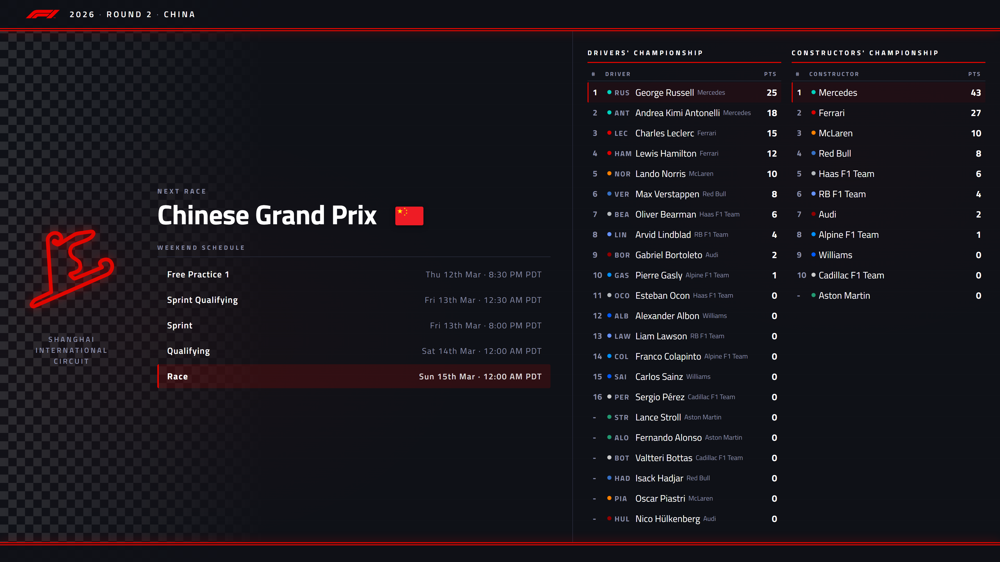

# F1 Dynamic Desktop Wallpaper — Live Race Schedule in Your Timezone + Live Championship Standings

A one-time install that runs forever. After setup, your desktop automatically stays current: it always shows the next upcoming race, every session time in your local timezone, and live Drivers' and Constructors' Championship standings that update after every race. No maintenance required.



---

## Why I Built This

As an F1 fan, one of the most frustrating things is tracking the race schedule. Sessions are almost always listed in the local time of the race venue, not yours. Every race weekend I'd find myself googling "when is the next F1 race in pacific time" or digging through the F1 app just to figure out when to tune in.

I wanted a calendar that just worked, no searching, no converting. So I built this: a desktop wallpaper that automatically pulls the next race from the F1 calendar, converts every session time (Free Practice, Sprint, Qualifying, Race) into your computer's local timezone, and sets it as your desktop background. It also shows the current Drivers' and Constructors' Championship standings so you always know where the season stands. Every time a race weekend passes, it updates itself to the next one.

Now I just glance at my desktop and I know exactly when Free Practice, Qualifying, and Race day are, in my time, without looking it up.

---

## What It Shows

- **Next race** — name, country flag, round number, season year
- **Full weekend schedule** — FP1, Sprint Qualifying, Sprint, Qualifying, Race (Race row highlighted), all in your local timezone
- **Circuit map** — glowing SVG layout for every track on the calendar
- **Championship standings** — full Drivers' and Constructors' leaderboard with team color dots and points, always reflecting the latest race results
- **Auto-updates** — refreshes every time you log into your device and daily at 9 AM; after each race weekend, it switches to the next one automatically, forever

---

## Requirements

- **Python 3.10+** — [python.org](https://www.python.org/downloads/)
- Internet connection (fetches live F1 data from the [Jolpica API](https://api.jolpi.ca))

| Platform | Supported |
|---|---|
| Windows 10/11 | ✅ Full support |
| macOS 12+ | ✅ Full support |
| Linux (GNOME, KDE, XFCE) | ✅ Full support |
| Linux (i3, other WMs) | ✅ via `feh` |

**Timezones** — works automatically for any timezone worldwide. `tzlocal` reads your system timezone and converts all session times locally. No configuration needed.

**Screen sizes** — renders at 4K (3840×2160) in 16:9. Behavior by screen type:

| Screen | Result |
|---|---|
| 16:9 (1080p, 1440p, 4K) | Perfect fit |
| 16:10 displays | Thin bars top and bottom, filled with matching dark background color |
| Ultrawide (21:9) | Dark bars on sides or slight crop depending on OS wallpaper setting |

---

## Setup — One Command

```bash
python3 install/setup.py
```

That's it. The script will:

1. Install Python dependencies (`requests`, `playwright`, `tzlocal`)
2. Download the Playwright Chromium browser
3. Download fonts and build the HTML template
4. Generate and set your first wallpaper immediately
5. Register an auto-update job for your platform

---

## How It Works

```
Jolpica F1 API  ──►  wallpaper_data.py   (fetch race + standings data)
                          │
                          ▼
                  generate_wallpaper.py   (inject data into HTML template)
                          │
                          ▼
                  Playwright Chromium     (render HTML → 3840×2160 PNG)
                          │
                          ▼
                  OS wallpaper API        (set as desktop wallpaper)
```

**Data sources**
| Data | Source |
|---|---|
| Next race + sessions | `api.jolpi.ca/ergast/f1/current/next.json` |
| Driver standings | `api.jolpi.ca/ergast/f1/current/driverStandings.json` |
| Constructor standings | `api.jolpi.ca/ergast/f1/current/constructorStandings.json` |
| Circuit SVG maps | `github.com/julesr0y/f1-circuits-svg` |
| Country flags | `flagcdn.com` |

---

## Auto-Update Schedule

After `setup.py`, an auto-update job is registered for your platform:

| Platform | Method | Schedule |
|---|---|---|
| Windows | Task Scheduler | At login + daily 9 AM |
| macOS | launchd | At login + daily 9 AM |
| Linux | crontab + XDG autostart | At login + daily 9 AM |

**To remove:**
```bash
# Windows
schtasks /Delete /TN F1WallpaperAutoUpdate /F

# macOS
launchctl unload ~/Library/LaunchAgents/com.f1wallpaper.autoupdate.plist
rm ~/Library/LaunchAgents/com.f1wallpaper.autoupdate.plist

# Linux
crontab -e   # delete the F1Wallpaper line
rm ~/.config/autostart/f1-wallpaper.desktop
```

---

## Manual Update

```bash
python3 scripts/generate_wallpaper.py
```

---

## File Structure

```
install/
  setup.py                        ← one-command setup (run this first)
  requirements_wallpaper.txt      ← Python dependencies
scripts/
  generate_wallpaper.py           ← main script: fetch → render → set wallpaper
  wallpaper_data.py               ← Jolpica API client + data types
  setup_auto_update.py            ← registers auto-update (all platforms)
  _fetch_fonts.py                 ← downloads Titillium Web fonts (dev use only)
  _write_template.py              ← regenerates HTML template (dev use only)
dashboard/
  wallpaper_template_src.html     ← source HTML/CSS template (edit this)
  wallpaper_template.html         ← generated output with embedded assets (do not edit)
  snippets/                       ← HTML row templates for sessions and standings
data/
  wallpaper/
    f1_logo.png                   ← F1 logo (embedded in template)
```

---

## Tech Stack

| Technology | Purpose |
|---|---|
| Python 3.10+ | Core scripting and data processing |
| Playwright (headless Chromium) | Renders HTML template to a 4K PNG |
| HTML/CSS | Wallpaper UI template |
| tzlocal | Automatic local timezone detection |
| Windows Task Scheduler | Auto-update on Windows (via PowerShell) |
| launchd | Auto-update on macOS |
| crontab + XDG autostart | Auto-update on Linux |

---

## Customization

**Change update time** — edit the trigger in `scripts/setup_auto_update.py`, then re-run it.

**Modify the design** — edit `dashboard/wallpaper_template_src.html`, then run:
```bash
python3 scripts/_write_template.py
```
